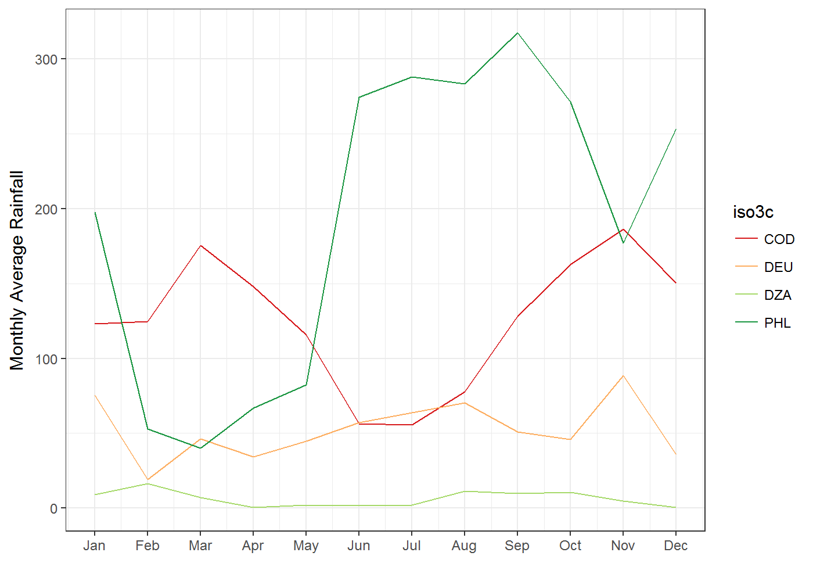

-   [The `rainfall` package](#the-rainfall-package)
    -   [Installation](#installation)
    -   [Functions & Output](#functions-output)
    -   [Usage](#usage)
    -   [More information on the data](#more-information-on-the-data)
    -   [Feedback & Questions](#feedback-questions)

<!-- README.md is generated from README.Rmd. Please edit that file -->
The `rainfall` package
======================

The `rainfall` package automatically downloads and processes rainfall data from the [Climatic Research Unit at the University of East Anglia](http://www.cru.uea.ac.uk/).

Installation
------------

The package is currently only available on GitHub. It can be installed through the `devtools` package.

``` r
devtools::install_github("felixhaass/rainfall")
```

Functions & Output
------------------

The package uses basically only one function: `download_rain`. This functions takes as input an ISO3 country code and downloads a file with monthly rainfall data for this country.

It outputs a `data.frame` with the following variables.

-   `iso3c`: ISO3 code of a country
-   `YEAR`: Year (currently 1901 - 2015)
-   `month`: Month (character string of month, JAN - DEC)
-   `month_numeric`: Month (numeric, 1-12)
-   `rain`: Monthly mean of rainfall in milimeters per month (<https://crudata.uea.ac.uk/cru/data/hrg/#info>)
-   `MAM, JJA, SON, DJF`: seasonal sum
-   `ANN`: Annual sum of mean rainfall per month

For more information see `help(download_rain)`.

If you supply a vector of ISO3 country codes `download_rain()` will download and combine the data for each country.

Usage
-----

We download monthly rainfall data for the Democratic Republic of the Congo. To get the DRC's ISO3 code we use the excellent [`countrycode`](https://cran.r-project.org/web/packages/countrycode/index.html) package.

``` r
library(countrycode)
library(rainfall)

country_iso3_list <- countrycode("Democratic Repulic of the Congo", 
                                 "country.name",
                                 "iso3c")

drc_rain <- download_rain(country = country_iso3_list, 
                          long = T, delete_raw = T)
```

This produces the following `data.frame` named `drc_rain` (only last 12 rows are shown):

| iso3c |  YEAR| month |  month\_numeric|   rain|    MAM|    JJA|    SON|  DJF|     ANN|
|:------|-----:|:------|---------------:|------:|------:|------:|------:|----:|-------:|
| COD   |  2015| JAN   |               1|  123.0|  439.1|  189.7|  476.8|   NA|  1503.6|
| COD   |  2015| FEB   |               2|  124.7|  439.1|  189.7|  476.8|   NA|  1503.6|
| COD   |  2015| MAR   |               3|  175.5|  439.1|  189.7|  476.8|   NA|  1503.6|
| COD   |  2015| APR   |               4|  147.9|  439.1|  189.7|  476.8|   NA|  1503.6|
| COD   |  2015| MAY   |               5|  115.8|  439.1|  189.7|  476.8|   NA|  1503.6|
| COD   |  2015| JUN   |               6|   56.3|  439.1|  189.7|  476.8|   NA|  1503.6|
| COD   |  2015| JUL   |               7|   55.5|  439.1|  189.7|  476.8|   NA|  1503.6|
| COD   |  2015| AUG   |               8|   77.9|  439.1|  189.7|  476.8|   NA|  1503.6|
| COD   |  2015| SEP   |               9|  128.0|  439.1|  189.7|  476.8|   NA|  1503.6|
| COD   |  2015| OCT   |              10|  162.6|  439.1|  189.7|  476.8|   NA|  1503.6|
| COD   |  2015| NOV   |              11|  186.2|  439.1|  189.7|  476.8|   NA|  1503.6|
| COD   |  2015| DEC   |              12|  150.3|  439.1|  189.7|  476.8|   NA|  1503.6|

The same works for multiple countries:

``` r
# Note that we add several countries to the list
country_list <- c("Democratic Repulic of the Congo",
                  "Germany", 
                  "Philippines", 
                  "Algeria")

country_iso3_list <- countrycode(country_list, 
                                 "country.name",
                                 "iso3c")

compare_rain <- download_rain(country = country_iso3_list, 
                          long = T, delete_raw = T)
```

We can now plot comparison of rainfall in these countries in 2015:

``` r
library(ggplot2)
library(dplyr)

compare_rain_plot <- compare_rain %>% 
  filter(YEAR == 2015) %>% 
  ggplot(., 
         aes(x = month_numeric, y = rain, group =iso3c)) +
  geom_line(aes(color = iso3c)) +
  scale_color_brewer(palette = "RdYlGn") +
  theme_bw() +
  scale_x_continuous(breaks=1:12, labels = month.abb) +
  labs(x = "", y = "Monthly Average Rainfall")

print(compare_rain_plot)
```



More information on the data
----------------------------

I did *not* create this data! For more information on the data, see the original research article describing the data:

> Harris, I, PD Jones, TJ Osborn & DH Lister (2014) [Updated high-resolution grids of monthly climatic observations - the CRU TS3.10 Dataset.](http://onlinelibrary.wiley.com/doi/10.1002/joc.3711/abstract) International Journal of Climatology 34(3): 623-642.

Or check out the [accompanying web page](https://crudata.uea.ac.uk/cru/data/hrg/).

Feedback & Questions
--------------------

For feedback, questions, and problems regarding the package, please use GitHub [Issues.](https://github.com/felixhaass/rainfall/issues).
